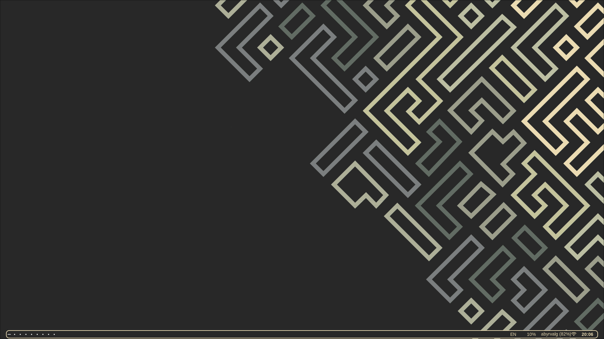
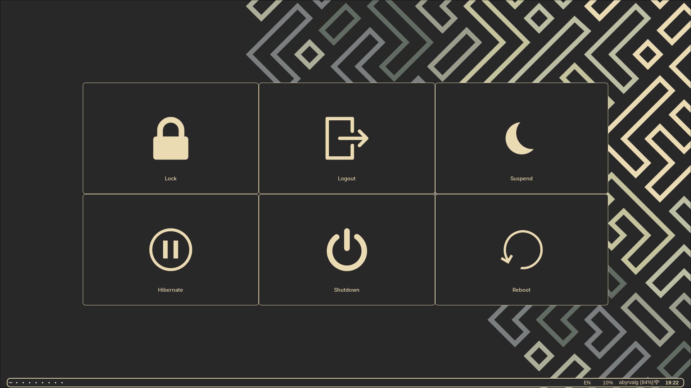
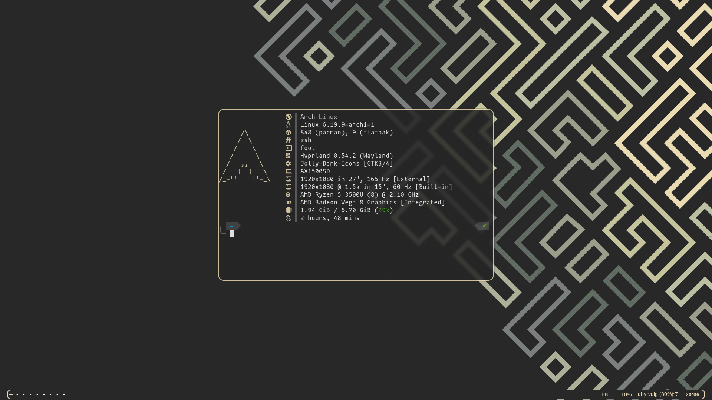
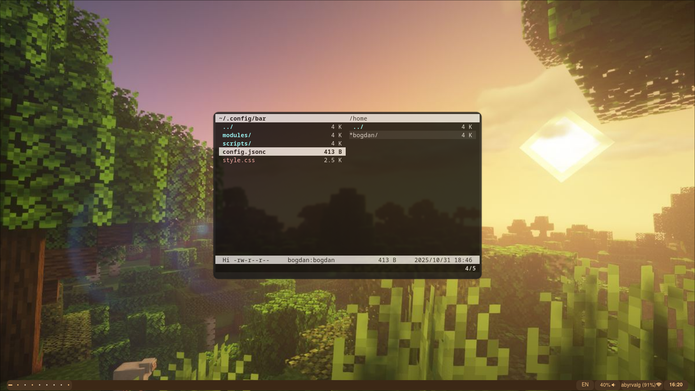
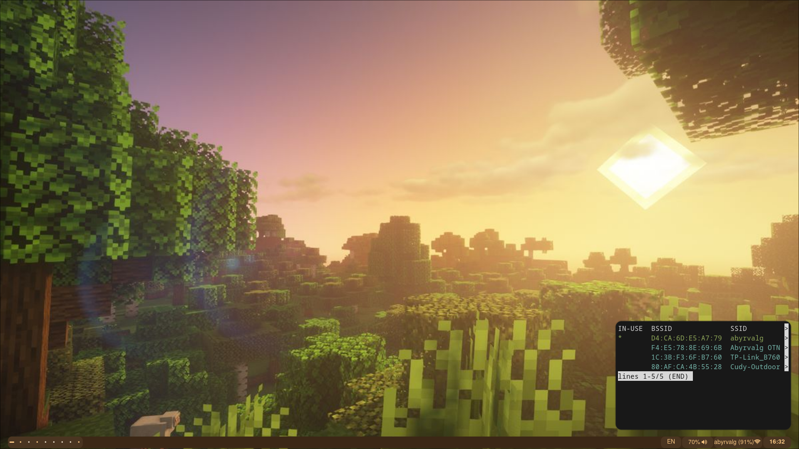
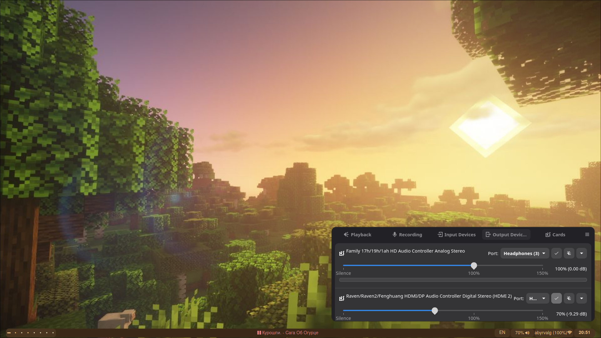

 Hi! Это мои доты hyprland

## Информация о репозитории
``
Данное рабочее окружение было построенно вокруг оконного менеджера hyprland на дистрибутиве cachyos.
Репозиторий включает в себя не только конфиги hyprland,но и терминала,консольного текстового редактора и fastfetch
Рабочее окружение расчитанно на два монитора.
``
## Основной софт и скрипты
* wm:`Hyprland`
* Терминал:`Alacritty`
* Меню выхода:`wlogout`(Ставил из aur)
* Экран блокировки:`hyprlock`
* Консольный текстовый редактор:`neovim`
* Консольный мониторинг процессов:`gotop`
* Консольный двухпанельный файловый менеджер:`vifm`
* Обычный файловый менеджер:`nemo`(для браузера)
* Браузер:`zen`
* Офис:`onlyoffice`
* Игрушки:`steam,prismlauncher,portproton,sober`
* Взять цвет с рабочего стола:`wl-color-picker`
* Обои:`hyprpapper`
* Графическое управление аудио:`pwvucontrol`
* Панелька снизу:`waybar`
* Программа для скриншотов:`hyprshot`
* Графический редактор:`krita`
* Заметки:`obsidian`
* Медиа проигрыватель:`vlc`
* Отображение часов в консоли:`tty-clock`
* Управление гтк темами:`nwg-look`
* Также есть скрипт по подключению к wifi из консоли,расположенный по пути `config/waybar/scripts`
## Комбинации клавиш
 * `super + return`- терминал
 * `super + esc` - gotop
 * `super + d` - discord
 * `super + c` - neovim 
 * `super + x` - закрыть текущее окно
 * `super + w ` - zen 
 * `super + y ` - zen -e youtube.com 
 * `super + SHIFT + w` - перезапуск waybar     
 * `super + n` - nemo
 * `super + SHIFT + n` - nwg-look
 * `super + f` - fastfetch
 * `super + q` - выход из окружения
 * `super + e` - vifm
 * `super + s` - стим
 * `super + SHIFT + s` - убить стим
 * `super + p` - скриншот рабочего стола
 * `super + SHIFT + p` - скриншот выбранного окна 
 * `super + SHIFT + t` - tty-clock
 * `super + t` - телеграм
 * `super + m` - prismlauncher
 * `super + o` - onlyoffice
 * `super + SHIFT + o` - obsidian
 * `super + v` - vlc
 * `super + SHIFT + k` - krita
 * `super + SHIFT + x` - wlogout
 * `super + SHIFT + c` - wl-color-picker 
 * `super + g` - portproton
 * `super + r` - sober
 * `Переключение между окнами в рабочем пространстве осуществляется по комбинации super + hjkl`
 * `Переключение между рабочими областями осущесвляется по комбинации super + 1-9`
 * `Перемещение окна на заданную рабочую область осуществляется по комбинации super +SHIFT + 1-9`
* `Управление громкостью осуществляется через XF86Audio`
# Снимки экрана
## Рабочий стол

## Кнопки питания 

## fastfetch

## vifm

## wifi

## pwvucontrol

<a>P.S:Я не знаю,если честно,как поставить другую тему в pwvucontrol</a>
# Настоятельно рекомендую сохранить старую конфигурацию в другое место!
# Удачи!
